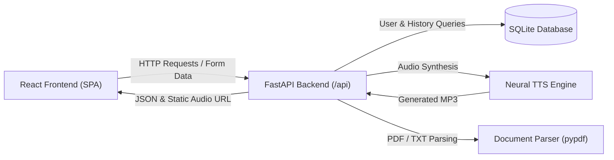
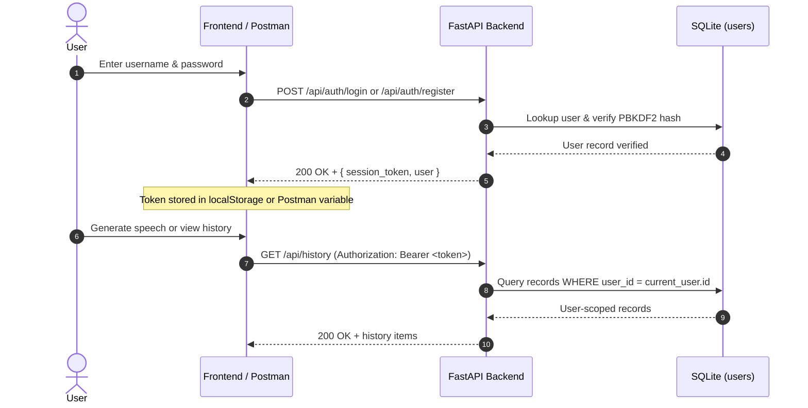
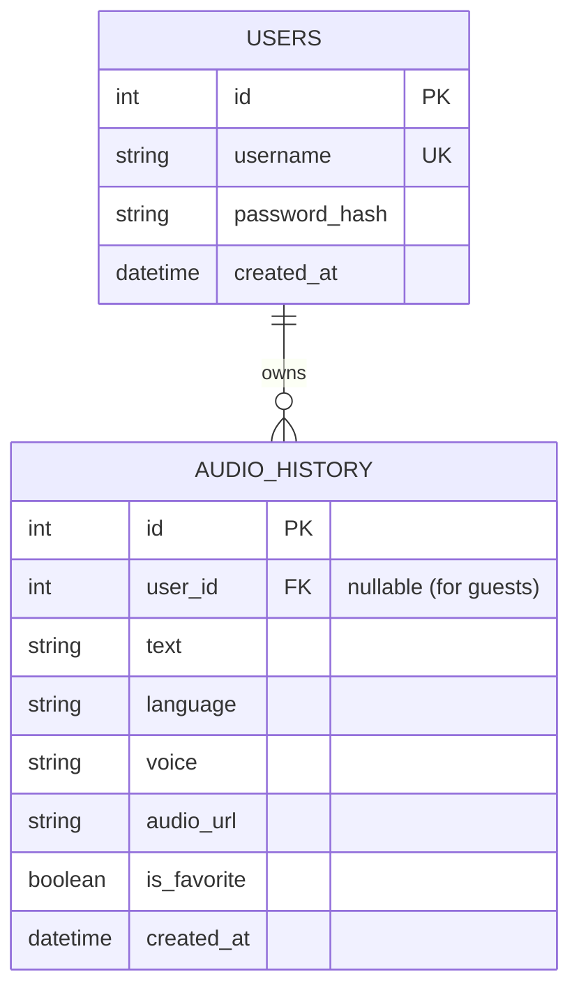

# Full-Stack Text-to-Speech Application — API Documentation

> **Project Deliverable** per Section 24 (*"Final Project Deliverables: 1. Source code, 2. GitHub repository, 3. README documentation, 4. Database schema, 5. API documentation, 8. Postman collection"*) of `Python -Text-to-Speech Application.pdf`.

---

## 1. System Architecture & Overview

The application is a full-stack, decoupled architecture comprising:
- **Frontend**: React 19 SPA built with Vite and Tailwind CSS (light theme with `#0057FF` and `#F8F7F4`).
- **Backend**: Python FastAPI asynchronous REST API.
- **Speech Engine**: Microsoft Neural Edge-TTS service generating high-fidelity MP3 speech with real-time rate, pitch, and volume adjustments.
- **Database**: SQLite with SQLAlchemy ORM supporting user-scoped speech history and favorites.
- **Document Processing**: `pypdf` server-side multi-page PDF & plain text document text extractor with whitespace normalization and character limit enforcement.
- **Security & Authentication**: PBKDF2-HMAC-SHA256 password hashing with cryptographic salt and URL-safe signed session tokens.



---

## 2. Server Configuration & Base URL

| Environment | Base URL | Notes |
| :--- | :--- | :--- |
| **Local Development** | `http://127.0.0.1:8000` | Default backend port configured in `.env` |
| **Vite Frontend Proxy** | `http://localhost:5173/api` | Proxied automatically to `127.0.0.1:8000` |
| **Interactive Docs (Swagger)** | `http://127.0.0.1:8000/docs` | Auto-generated OpenAPI schema |
| **Interactive Docs (ReDoc)** | `http://127.0.0.1:8000/redoc` | Clean documentation layout |

---

## 3. Authentication & Security Flow

The API supports both **Guest Sessions** and **Authenticated User Accounts** (PDF Section 17 & 25 Level 2):
1. **Unauthenticated (Guest)**: Requests without an `Authorization` header interact with public history records (`user_id = NULL`).
2. **Authenticated (User)**: Pass `Authorization: Bearer <session_token>` in the request header. Generated speech and history records are strictly scoped to the authenticated user account.



---

## 4. API Endpoints Reference

### 4.1 Health Check

#### `GET /api/health`
Verifies backend server liveness and database accessibility.

- **Authentication**: None (Public)
- **Response (200 OK)**:
  ```json
  {
    "status": "ok"
  }
  ```

---

### 4.2 Available Voices & Languages

#### `GET /api/voices`
Retrieves curated neural voices categorized by language and gender.

- **Authentication**: None (Public)
- **Response (200 OK)**:
  ```json
  {
    "voices": [
      {
        "id": "en-US-JennyNeural",
        "name": "Jenny (Female)",
        "gender": "Female",
        "language": "English (US)"
      },
      {
        "id": "hi-IN-SwaraNeural",
        "name": "Swara (Female)",
        "gender": "Female",
        "language": "Hindi (India)"
      }
    ],
    "languages": [
      "English (US)",
      "Hindi (India)",
      "Gujarati (India)",
      "Marathi (India)",
      "Spanish (Spain)",
      "French (France)",
      "German (Germany)"
    ]
  }
  ```

---

### 4.3 Text-to-Speech Synthesis

#### `POST /api/tts`
Converts input text into neural speech audio with customization parameters.

- **Authentication**: Optional (`Authorization: Bearer <token>` links audio to user account)
- **Request Body (`application/json`)**:
  | Field | Type | Required | Description | Constraints |
  | :--- | :--- | :--- | :--- | :--- |
  | `text` | string | **Yes** | Input text to synthesize | 1 – 1,000 characters |
  | `voice` | string | No | Neural voice ID | Must exist in supported voices |
  | `language` | string | No | Language name | Optional fallback |
  | `rate` | string | No | Speed adjustment | e.g. `"+0%"`, `"+25%"`, `"-20%"` |
  | `pitch` | string | No | Pitch adjustment | e.g. `"+0Hz"`, `"+10Hz"`, `"-15Hz"` |
  | `volume` | string | No | Volume adjustment | e.g. `"+0%"`, `"+10%"`, `"-30%"` |

- **Sample Request**:
  ```json
  {
    "text": "Welcome to our Text to Speech application.",
    "voice": "en-US-JennyNeural",
    "language": "English (US)",
    "rate": "+0%",
    "pitch": "+0Hz",
    "volume": "+0%"
  }
  ```

- **Response (200 OK)**:
  ```json
  {
    "success": true,
    "audio_url": "/audio/tts_a1b2c3d4.mp3",
    "filename": "tts_a1b2c3d4.mp3",
    "char_count": 42,
    "word_count": 7,
    "voice": "en-US-JennyNeural"
  }
  ```

- **Error Responses**:
  - `400 Bad Request`: Whitespace-only text or invalid voice name.
  - `422 Unprocessable Entity`: Text missing or exceeds 1,000 characters.
  - `503 Service Unavailable`: Upstream TTS engine unreachable.

---

### 4.4 Multi-Format Document Text Extraction

#### `POST /api/extract-text`
Accepts `.txt` and `.pdf` files, extracts textual content, normalizes whitespace, and truncates to 1,000 characters.

- **Authentication**: None (Public)
- **Content-Type**: `multipart/form-data`
- **Form Field**:
  - `file`: Binary file upload (`.txt` or `.pdf`)
- **Response (200 OK)**:
  ```json
  {
    "success": true,
    "text": "Extracted document content...",
    "filename": "lecture_notes.pdf",
    "char_count": 850,
    "page_count": 3,
    "truncated": false
  }
  ```
- **Error Responses**:
  - `400 Bad Request`: Empty file, corrupt PDF, unsupported file type (e.g. `.exe`, `.png`), or document containing no extractable text.

---

### 4.5 User Authentication (Level 2)

#### `POST /api/auth/register`
Creates a new user account with unique username and PBKDF2 hashed password.

- **Request Body (`application/json`)**:
  ```json
  {
    "username": "developer_intern",
    "password": "Password123!"
  }
  ```
- **Response (200 OK)**:
  ```json
  {
    "success": true,
    "message": "Account created successfully.",
    "session_token": "dXNlcl8xOjE3MjY3MjAwMDA6NmQ0...",
    "user": {
      "id": 1,
      "username": "developer_intern",
      "created_at": "2026-09-18T12:00:00"
    }
  }
  ```
- **Error Responses**:
  - `400 Bad Request`: Username already taken or password shorter than 4 characters.

#### `POST /api/auth/login`
Authenticates existing credentials and issues a signed session token.

- **Request Body (`application/json`)**:
  ```json
  {
    "username": "developer_intern",
    "password": "Password123!"
  }
  ```
- **Response (200 OK)**:
  ```json
  {
    "success": true,
    "session_token": "dXNlcl8xOjE3MjY3MjAwMDA6NmQ0...",
    "user": {
      "id": 1,
      "username": "developer_intern",
      "created_at": "2026-09-18T12:00:00"
    }
  }
  ```
- **Error Responses**:
  - `401 Unauthorized`: Invalid username or password.

#### `GET /api/auth/me`
Retrieves profile information for the authenticated session token.

- **Headers**: `Authorization: Bearer <session_token>`
- **Response (200 OK)**:
  ```json
  {
    "id": 1,
    "username": "developer_intern",
    "created_at": "2026-09-18T12:00:00"
  }
  ```
- **Error Responses**:
  - `401 Unauthorized`: Missing, expired, or invalid session token.

---

### 4.6 Speech History Management

#### `GET /api/history`
Retrieves speech generation history records scoped to the current user (or guest records if unauthenticated).

- **Authentication**: Optional (`Authorization: Bearer <token>`)
- **Query Parameters**:
  - `limit` (integer, default: 50, max: 100)
  - `offset` (integer, default: 0)
- **Response (200 OK)**:
  ```json
  {
    "total": 1,
    "history": [
      {
        "id": 1,
        "text": "Welcome to our Text to Speech application.",
        "language": "English (US)",
        "voice": "en-US-JennyNeural",
        "audio_url": "/audio/tts_a1b2c3d4.mp3",
        "is_favorite": false,
        "created_at": "2026-09-18T12:05:00"
      }
    ]
  }
  ```

#### `PATCH /api/history/{id}/favorite`
Toggles the favorite status (`is_favorite`) of a history item.

- **Authentication**: Optional (Scoped to user if authenticated)
- **Response (200 OK)**:
  ```json
  {
    "success": true,
    "id": 1,
    "is_favorite": true
  }
  ```
- **Error Responses**:
  - `404 Not Found`: Item ID does not exist or belongs to another user.

#### `DELETE /api/history/{id}`
Deletes a single speech history record and its associated audio file.

- **Response (200 OK)**:
  ```json
  {
    "success": true,
    "message": "History item 1 deleted successfully."
  }
  ```

#### `DELETE /api/history`
Clears all history records scoped to the current user (or guest records).

- **Response (200 OK)**:
  ```json
  {
    "success": true,
    "message": "History cleared successfully."
  }
  ```

---

## 5. Database Schema (SQLite)



---

## 6. How to Use the Postman Collection

The repository includes a ready-to-run Postman collection: `postman_collection.json`.

### Steps:
1. Open **Postman**.
2. Click the **Import** button in the top left.
3. Drag and drop `postman_collection.json` (or browse to `c:/myProject/texttospeech/postman_collection.json`).
4. Select the collection **"Text-to-Speech API"**.
5. The `baseUrl` variable is pre-configured to `http://127.0.0.1:8000`.
6. Run **"Register User"** or **"User Login"**:
   - The test script will **automatically extract the session token** and set the `{{authToken}}` variable.
   - All subsequent requests (History, User Profile, Scoped TTS) will automatically use this token.
7. Click **Run Collection** to execute all automated test scripts in sequence.
